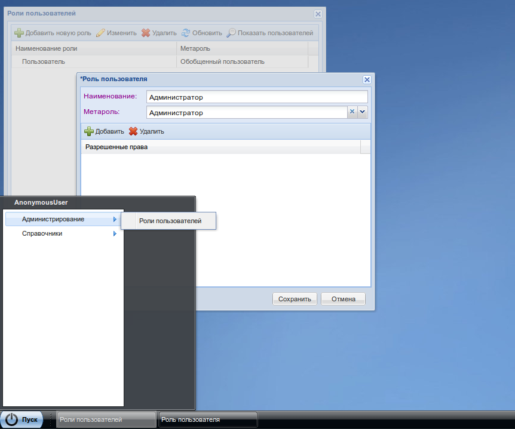

Использование
=============

После подключения модуля к проекту, необходимо добавить окно редактирования ролей пользователей в меню и в системе появится возможность редактирования прав ролей пользователей.

Например

::

    # app_meta.py

    from m3_users.roles import RolesWindowAction
    from m3_ext.ui import app_ui

    admin_group = app_ui.DesktopLaunchGroup(name=u'Администрирование')

    admin_group.subitems.append(
        app_ui.DesktopLauncher(name=u'Роли пользователей',
                               url=RolesWindowAction.absolute_url())
    )

    app_ui.DesktopLoader.add(app_ui.get_metarole(app_ui.GENERIC_USER),
                            app_ui.DesktopLoader.START_MENU,
                            admin_group)

|pict1|

